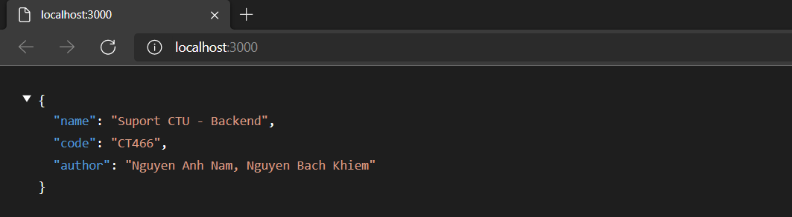

# Run server

-  Open new terminal
-  Look at the `package.json` file

---

### Step 1. Download dependencies

-  `npm install` or `npm i`

### Step 2. Create .env file

-  Copy file `.env.bash`, create name like `.env`
-  Change content in `.env`

### Step 3. Setup Database

-  Download `MySQL` and `MySQL Workbench`
-  Create new Database (example `ct466`)
-  Import `SQL_Script.sql` (from my project)
-  Run script.

### Step 4. Start server

-  At current terminal, run `npm start`.
-  Follow the log in the terminal to view the answer.

-  

---
